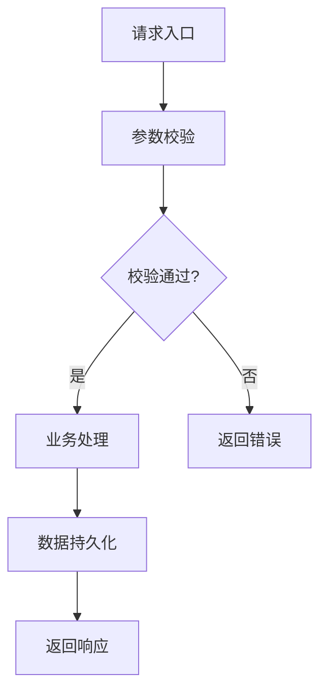
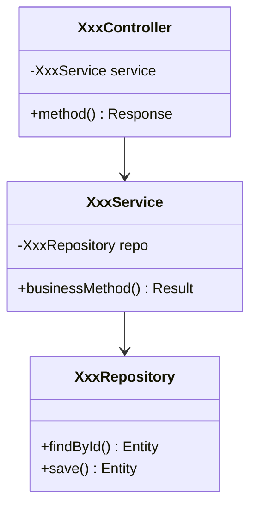

# 技术实施方案模板

## 1. 方案概述

**功能编号**：SPEC-XXX  
**功能名称**：XXX功能  
**所属模块**：XXX模块  
**版本**：1.0  
**创建日期**：YYYY-MM-DD  
**状态**：待评审 | 已通过 | 实施中 | 已完成  

---

## 2. 需求分析

### 2.1 功能需求回顾

简要回顾功能规格说明书中的核心需求。

### 2.2 技术挑战

| 挑战 | 描述 | 风险等级 |
|------|------|----------|
| 高并发 | 需要处理大量请求 | 高 |
| 数据一致性 | 多表关联操作 | 中 |

---

## 3. 技术方案

### 3.1 架构设计

#### 3.1.1 模块划分

| 模块 | 职责 | 状态 |
|------|------|------|
| controller | REST API 入口 | 新增 |
| service | 业务逻辑处理 | 新增 |
| repository | 数据访问 | 新增 |
| dto | 数据传输对象 | 新增 |

#### 3.1.2 核心流程图



#### 3.1.3 类图



### 3.2 目录结构

```
src/main/java/com/mk/salesAgent/
├── controller/
│   └── XxxController.java      # REST API 控制器
├── service/
│   └── XxxService.java         # 业务逻辑层
├── repository/
│   └── XxxRepository.java      # 数据访问层
├── dto/
│   ├── XxxRequest.java         # 请求 DTO
│   └── XxxResponse.java        # 响应 DTO
└── entity/
    └── XxxEntity.java          # 数据库实体
```

### 3.3 关键类设计

#### 3.3.1 Controller 类

| 类名 | 文件路径 | 职责 |
|------|----------|------|
| XxxController | controller/XxxController.java | 处理 HTTP 请求，参数校验，调用 Service |

**方法设计**：

| 方法名 | 功能说明 | 参数 | 返回值 |
|--------|----------|------|--------|
| methodName | 描述 | RequestDTO | ResponseEntity |

#### 3.3.2 Service 类

| 类名 | 文件路径 | 职责 |
|------|----------|------|
| XxxService | service/XxxService.java | 业务逻辑处理，事务管理 |

**方法设计**：

| 方法名 | 功能说明 | 参数 | 返回值 |
|--------|----------|------|--------|
| businessMethod | 描述 | 参数列表 | 业务结果 |

#### 3.3.3 Repository 类

| 类名 | 文件路径 | 职责 |
|------|----------|------|
| XxxRepository | repository/XxxRepository.java | 数据库访问，继承 JpaRepository |

**方法设计**：

| 方法名 | 功能说明 | 参数 | 返回值 |
|--------|----------|------|--------|
| findByXxx | 根据条件查询 | 参数列表 | Entity/List |

### 3.4 数据库设计

#### 3.4.1 表结构

**表名**：xxx_table

| 字段名 | 类型 | 约束 | 说明 |
|--------|------|------|------|
| id | BIGINT | PRIMARY KEY, AUTO_INCREMENT | 主键 |
| field1 | VARCHAR(50) | NOT NULL | 字段1 |
| field2 | INT | DEFAULT 0 | 字段2 |
| created_at | DATETIME | NOT NULL, DEFAULT CURRENT_TIMESTAMP | 创建时间 |

#### 3.4.2 索引设计

| 索引名 | 字段 | 类型 | 说明 |
|--------|------|------|------|
| uk_field1 | field1 | UNIQUE | 唯一索引 |
| idx_field2 | field2 | INDEX | 普通索引 |

### 3.5 API 接口设计

#### 3.5.1 接口列表

| API 路径 | HTTP 方法 | 所属文件 |
|----------|-----------|----------|
| /api/xxx | POST | XxxController.java |

#### 3.5.2 请求结构

| 字段 | 类型 | 必填 | 说明 |
|------|------|------|------|
| field1 | String | 是 | 说明 |
| field2 | Integer | 否 | 说明 |

#### 3.5.3 响应结构

| 字段 | 类型 | 说明 |
|------|------|------|
| code | Integer | 状态码 |
| message | String | 提示信息 |
| data | Object | 数据内容 |

---

## 4. 部署与集成

### 4.1 依赖说明

| 依赖 | GroupId | ArtifactId | 版本 |
|------|---------|------------|------|
| Spring Boot Starter Web | org.springframework.boot | spring-boot-starter-web | 3.5.11 |

### 4.2 配置说明

```yaml
# application.yml 新增配置
feature:
  xxx:
    enabled: true
    timeout: 30000
```

### 4.3 集成测试

| 测试场景 | 测试方法 | 预期结果 |
|----------|----------|----------|
| 正常请求 | 调用 API | 返回 200 |
| 异常请求 | 不传必填参数 | 返回 400 |

---

## 5. 代码安全性

### 5.1 注意事项

| 风险点 | 描述 | 关联模块 |
|--------|------|----------|
| SQL 注入 | 动态拼接 SQL | Repository |
| 参数校验 | 未校验的输入 | Controller |
| 敏感信息泄露 | 日志打印敏感数据 | Service |

### 5.2 解决方案

| 风险点 | 解决方案 |
|--------|----------|
| SQL 注入 | 使用 JPA 参数化查询 |
| 参数校验 | 使用 @Valid 注解 |
| 敏感信息泄露 | 日志脱敏处理 |

---

## 6. 评审记录

| 日期 | 评审人 | 意见 | 状态 |
|------|--------|------|------|
| YYYY-MM-DD | XXX | 无意见 | 通过 |
