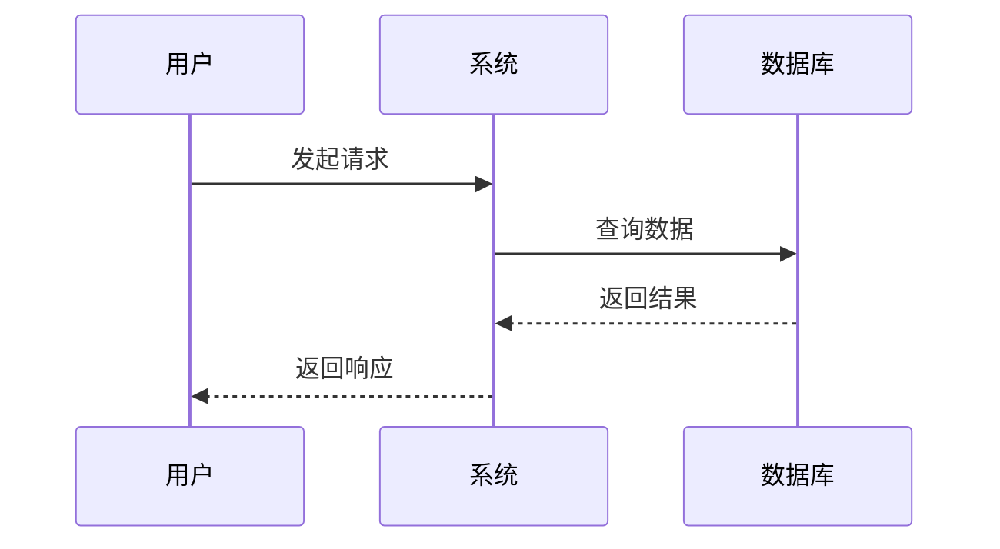
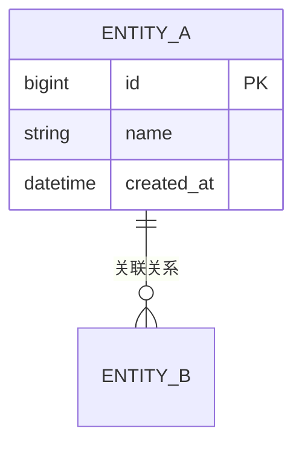

# 功能规格说明书模板

## 1. 功能概述

**功能编号**：SPEC-XXX  
**功能名称**：XXX功能  
**所属模块**：XXX模块  
**版本**：1.0  
**创建日期**：YYYY-MM-DD  
**状态**：待评审 | 已通过 | 已实现 | 已上线  

---

## 2. 业务背景

描述功能产生的业务背景和需求来源。

---

## 3. 功能需求

### 3.1 功能描述

清晰描述功能的核心能力和业务价值。

### 3.2 需求来源

| 来源类型 | 编号 | 描述 |
|----------|------|------|
| 产品需求 | PRD-XXX | XXX |
| 用户反馈 | FBK-XXX | XXX |
| 技术债务 | DEBT-XXX | XXX |

### 3.3 功能边界

- 包含：XXX
- 不包含：XXX

---

## 4. 业务流程

### 4.1 流程图（Mermaid）



### 4.2 流程说明

1. 步骤一：XXX
2. 步骤二：XXX
3. 步骤三：XXX

---

## 5. 接口设计

### 5.1 接口清单

| API 路径 | HTTP 方法 | 所属文件 | 功能描述 |
|----------|-----------|----------|----------|
| /api/xxx | POST | XxxController.java | XXX功能 |

### 5.2 请求结构

```json
{
  "field1": "string (必填，说明)",
  "field2": "number (选填，说明)"
}
```

### 5.3 响应结构

```json
{
  "code": "number (状态码)",
  "message": "string (提示信息)",
  "data": {
    "result": "string (结果)"
  }
}
```

### 5.4 错误响应

| 错误码 | 错误信息 | 触发条件 |
|--------|----------|----------|
| 400 | 参数错误 | 必填参数缺失 |
| 401 | 未授权 | Token 无效 |
| 500 | 服务器错误 | 系统异常 |

---

## 6. 数据模型

### 6.1 实体关系



### 6.2 字段定义

| 字段名 | 类型 | 约束 | 说明 |
|--------|------|------|------|
| id | BIGINT | PRIMARY KEY | 主键 |
| name | VARCHAR(50) | NOT NULL | 名称 |

---

## 7. 业务规则

| 规则编号 | 规则描述 | 优先级 |
|----------|----------|--------|
| RULE-001 | XXX规则 | 高 |
| RULE-002 | XXX规则 | 中 |

---

## 8. 非功能需求

### 8.1 性能要求

| 指标 | 要求 |
|------|------|
| 响应时间 | < 200ms |
| QPS | 1000+ |

### 8.2 安全要求

- 认证：XXX
- 授权：XXX
- 加密：XXX

---

## 9. 验收标准

### 9.1 功能验收

| 测试用例 | 预期结果 |
|----------|----------|
| 用例1 | 通过 |
| 用例2 | 通过 |

### 9.2 边界条件

| 场景 | 预期结果 |
|------|----------|
| 空数据 | 返回空列表 |
| 异常输入 | 返回错误提示 |

---

## 10. 依赖关系

### 10.1 上游依赖

| 模块 | 说明 |
|------|------|
| auth | 用户认证 |

### 10.2 下游依赖

| 模块 | 说明 |
|------|------|
| database | 数据存储 |

---

## 11. 评审记录

| 日期 | 评审人 | 意见 | 状态 |
|------|--------|------|------|
| YYYY-MM-DD | XXX | 无意见 | 通过 |
