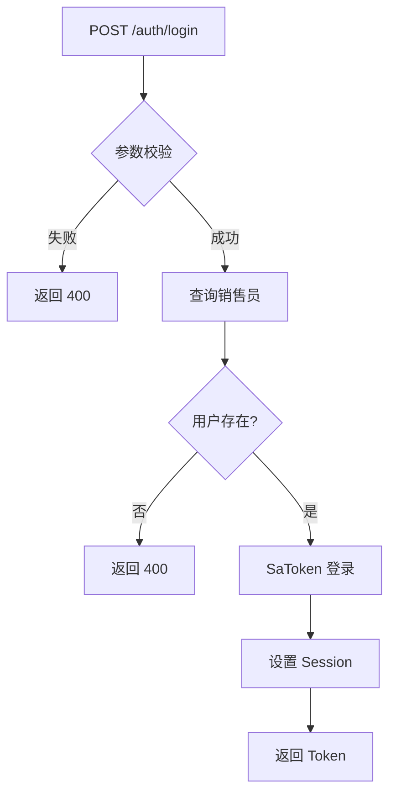
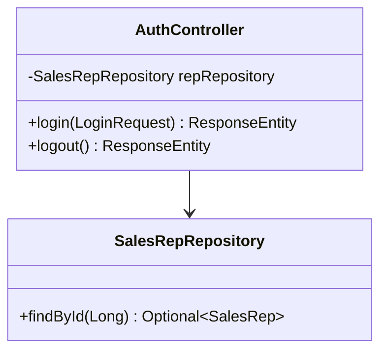

# 用户认证模块 - 技术实施方案

## 1. 方案概述

**功能编号**：SPEC-001  
**功能名称**：用户认证  
**所属模块**：auth  
**版本**：1.0  
**创建日期**：2024-01-15  
**状态**：已通过  

---

## 2. 需求分析

### 2.1 功能需求回顾

实现用户登录和登出功能，基于 Sa-Token 框架进行认证管理。

### 2.2 技术挑战

| 挑战 | 描述 | 风险等级 |
|------|------|----------|
| Token 安全性 | 防止 Token 泄露和伪造 | 高 |
| 并发登录 | 支持同一用户多设备登录 | 中 |

---

## 3. 技术方案

### 3.1 架构设计

#### 3.1.1 模块划分

| 模块 | 职责 | 状态 |
|------|------|------|
| AuthController | 处理登录/登出请求 | 新增 |
| SalesRepRepository | 查询销售员信息 | 复用 |
| Sa-Token | 认证框架 | 引入 |

#### 3.1.2 核心流程图



#### 3.1.3 类图



### 3.2 目录结构

```
src/main/java/com/mk/salesAgent/
├── controller/
│   └── AuthController.java      # 认证控制器
└── repository/
    └── SalesRepRepository.java  # 销售员数据访问
```

### 3.3 关键类设计

#### 3.3.1 AuthController

| 类名 | 文件路径 | 职责 |
|------|----------|------|
| AuthController | controller/AuthController.java | 处理登录登出请求 |

**方法设计**：

| 方法名 | 功能说明 | 参数 | 返回值 |
|--------|----------|------|--------|
| login | 用户登录 | LoginRequest (repId: Long) | ResponseEntity |
| logout | 用户登出 | 无 | ResponseEntity |

#### 3.3.2 SalesRepRepository

| 类名 | 文件路径 | 职责 |
|------|----------|------|
| SalesRepRepository | repository/SalesRepRepository.java | 查询销售员信息 |

**方法设计**：

| 方法名 | 功能说明 | 参数 | 返回值 |
|--------|----------|------|--------|
| findById | 根据ID查询 | Long id | Optional\<SalesRep\> |

### 3.4 数据库设计

#### 3.4.1 表结构

**表名**：sa_sales_rep

| 字段名 | 类型 | 约束 | 说明 |
|--------|------|------|------|
| id | BIGINT | PRIMARY KEY, AUTO_INCREMENT | 主键 |
| name | VARCHAR(50) | NOT NULL | 姓名 |
| region_id | BIGINT | NOT NULL, FK | 大区ID |
| role | VARCHAR(20) | NOT NULL | 角色 |
| email | VARCHAR(100) | NULL | 邮箱 |
| created_at | DATETIME | NOT NULL | 创建时间 |

#### 3.4.2 索引设计

| 索引名 | 字段 | 类型 | 说明 |
|--------|------|------|------|
| PRIMARY | id | PRIMARY KEY | 主键索引 |
| idx_region | region_id | INDEX | 大区索引 |

### 3.5 API 接口设计

#### 3.5.1 接口列表

| API 路径 | HTTP 方法 | 所属文件 |
|----------|-----------|----------|
| /auth/login | POST | AuthController.java |
| /auth/logout | POST | AuthController.java |

#### 3.5.2 请求结构

**登录请求**：

| 字段 | 类型 | 必填 | 说明 |
|------|------|------|------|
| repId | Long | 是 | 销售员ID |

**登出请求**：

| 字段 | 类型 | 必填 | 说明 |
|------|------|------|------|
| 无 | - | - | 依赖请求头 Token |

#### 3.5.3 响应结构

**登录成功响应**：

| 字段 | 类型 | 说明 |
|------|------|------|
| token | String | 认证令牌 |
| username | String | 用户名 |
| role | String | 用户角色 |

**登出成功响应**：

| 字段 | 类型 | 说明 |
|------|------|------|
| message | String | 提示信息 |

---

## 4. 部署与集成

### 4.1 依赖说明

| 依赖 | GroupId | ArtifactId | 版本 |
|------|---------|------------|------|
| Sa-Token | cn.dev33 | sa-token-spring-boot3-starter | 1.39.0 |

### 4.2 配置说明

```yaml
sa-token:
  token-name: Authorization
  timeout: 86400
  is-concurrent: true
  token-style: uuid
```

### 4.3 集成测试

| 测试场景 | 测试方法 | 预期结果 |
|----------|----------|----------|
| 正确 repId 登录 | 调用 POST /auth/login | 返回 200 和 Token |
| 不存在的 repId | 调用 POST /auth/login | 返回 400 |
| 携带 Token 登出 | 调用 POST /auth/logout | 返回 200 |

---

## 5. 代码安全性

### 5.1 注意事项

| 风险点 | 描述 | 关联模块 |
|--------|------|----------|
| Token 泄露 | Token 被截获 | AuthController |
| 暴力破解 | 恶意尝试登录 | AuthController |

### 5.2 解决方案

| 风险点 | 解决方案 |
|--------|----------|
| Token 泄露 | 使用 HTTPS 传输，Token 存储在 HttpOnly Cookie |
| 暴力破解 | 记录登录失败次数，超过阈值锁定账户 |

---

## 6. 评审记录

| 日期 | 评审人 | 意见 | 状态 |
|------|--------|------|------|
| 2024-01-15 | 架构师 | 无意见 | 通过 |
