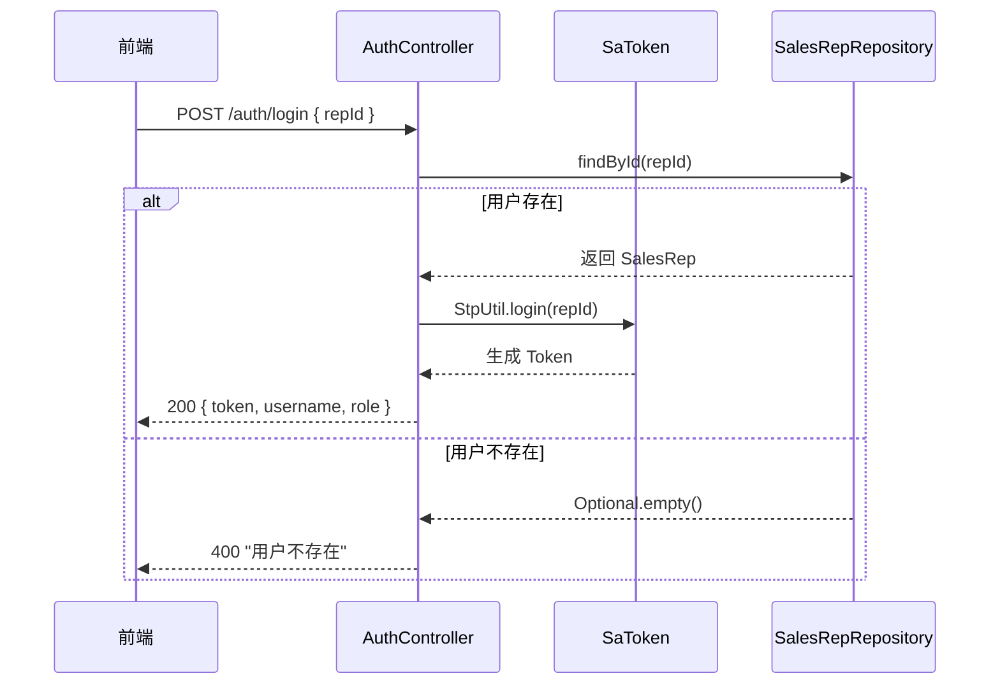
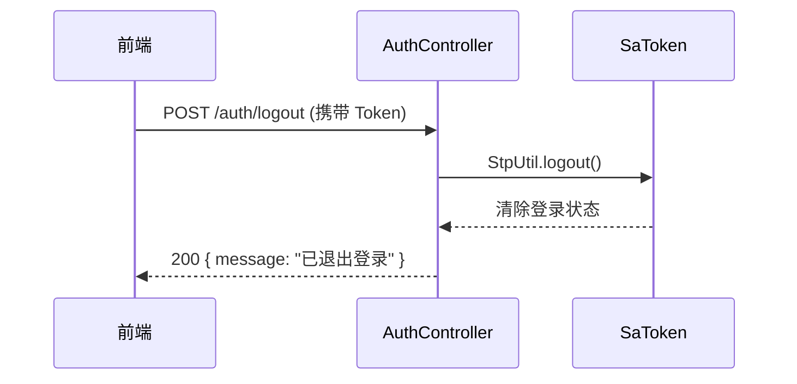
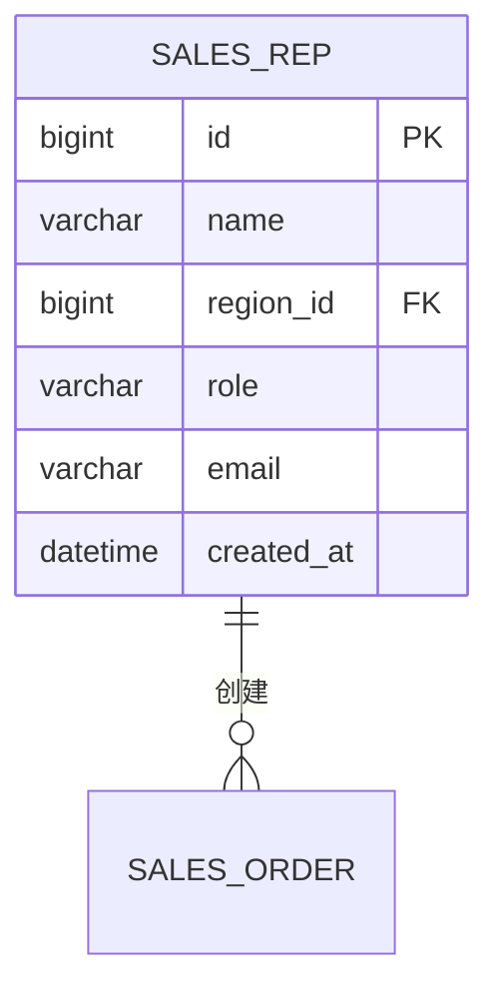

# 用户认证模块 - 功能规格说明书

## 1. 功能概述

**功能编号**：SPEC-001  
**功能名称**：用户认证  
**所属模块**：auth  
**版本**：1.0  
**创建日期**：2024-01-15  
**状态**：已通过  

---

## 2. 业务背景

销售 Agent 系统需要对用户进行身份认证，确保只有授权用户才能访问系统。用户通过销售员 ID 进行登录，系统验证身份后颁发 Token，后续请求携带 Token 进行身份校验。

---

## 3. 功能需求

### 3.1 功能描述

- 用户登录：通过销售员 ID 登录系统
- 用户登出：清除用户登录状态
- Token 验证：验证请求中的 Token 有效性

### 3.2 需求来源

| 来源类型 | 编号 | 描述 |
|----------|------|------|
| 产品需求 | PRD-001 | 系统需要用户认证机制 |

### 3.3 功能边界

- 包含：登录、登出、Token 验证
- 不包含：用户注册、密码找回（系统用户由管理员维护）

---

## 4. 业务流程

### 4.1 登录流程图



### 4.2 登出流程图



---

## 5. 接口设计

### 5.1 接口清单

| API 路径 | HTTP 方法 | 所属文件 | 功能描述 |
|----------|-----------|----------|----------|
| /auth/login | POST | AuthController.java | 用户登录 |
| /auth/logout | POST | AuthController.java | 用户登出 |

### 5.2 登录接口

**请求结构**：

```json
{
  "repId": "long (必填，销售员ID)"
}
```

**成功响应**：

```json
{
  "token": "string (认证令牌)",
  "username": "string (用户名)",
  "role": "string (角色: SALES_REP/SALES_MANAGER/SALES_DIRECTOR)"
}
```

**失败响应**：

```json
{
  "code": 400,
  "message": "用户不存在",
  "timestamp": "2024-01-15T10:30:00Z"
}
```

### 5.3 登出接口

**请求头**：`Authorization: Bearer {token}`

**成功响应**：

```json
{
  "message": "已退出登录"
}
```

### 5.4 错误响应

| 错误码 | 错误信息 | 触发条件 |
|--------|----------|----------|
| 400 | 用户不存在 | repId 对应的用户不存在 |
| 401 | 请先登录 | Token 无效或过期 |

---

## 6. 数据模型

### 6.1 实体关系



### 6.2 字段定义

| 字段名 | 类型 | 约束 | 说明 |
|--------|------|------|------|
| id | BIGINT | PRIMARY KEY, AUTO_INCREMENT | 销售员ID |
| name | VARCHAR(50) | NOT NULL | 姓名 |
| region_id | BIGINT | NOT NULL, FK | 所属大区ID |
| role | VARCHAR(20) | NOT NULL, DEFAULT 'SALES_REP' | 角色 |
| email | VARCHAR(100) | NULL | 邮箱 |
| created_at | DATETIME | NOT NULL, DEFAULT CURRENT_TIMESTAMP | 创建时间 |

---

## 7. 业务规则

| 规则编号 | 规则描述 | 优先级 |
|----------|----------|--------|
| RULE-AUTH-001 | 只有存在的销售员才能登录 | 高 |
| RULE-AUTH-002 | Token 有效期为 24 小时 | 高 |
| RULE-AUTH-003 | 同一用户可在多个设备登录 | 中 |

---

## 8. 非功能需求

### 8.1 性能要求

| 指标 | 要求 |
|------|------|
| 响应时间 | < 100ms |
| QPS | 5000+ |

### 8.2 安全要求

- Token 存储在 HttpOnly Cookie 中
- Token 传输使用 HTTPS
- 登录失败超过 5 次触发账户锁定

---

## 9. 验收标准

### 9.1 功能验收

| 测试用例 | 预期结果 |
|----------|----------|
| 正确 repId 登录 | 返回 Token 和用户信息 |
| 不存在的 repId | 返回 400 错误 |
| 携带有效 Token 登出 | 返回成功消息 |
| 无效 Token 请求 | 返回 401 错误 |

---

## 10. 依赖关系

### 10.1 上游依赖

| 模块 | 说明 |
|------|------|
| SalesRepRepository | 查询销售员信息 |

### 10.2 下游依赖

| 模块 | 说明 |
|------|------|
| Sa-Token | 认证框架 |

---

## 11. 评审记录

| 日期 | 评审人 | 意见 | 状态 |
|------|--------|------|------|
| 2024-01-15 | 架构师 | 无意见 | 通过 |
