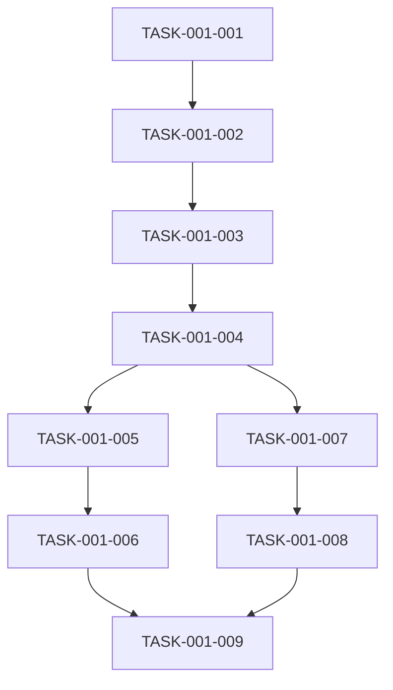

# 用户认证模块 - 任务拆解清单

## 1. 任务概览

| 任务编号 | 任务名称 | 负责人 | 预估工时 | 状态 |
|----------|----------|--------|----------|------|
| TASK-001-001 | 引入 Sa-Token 依赖 | 后端开发 | 0.5h | 待开始 |
| TASK-001-002 | 配置 Sa-Token | 后端开发 | 0.5h | 待开始 |
| TASK-001-003 | 创建 AuthController | 后端开发 | 1h | 待开始 |
| TASK-001-004 | 编写登录方法 | 后端开发 | 1h | 待开始 |
| TASK-001-005 | 编写登出方法 | 后端开发 | 0.5h | 待开始 |
| TASK-001-006 | 编写单元测试 | 后端开发 | 1h | 待开始 |
| TASK-001-007 | 前端登录页面 | 前端开发 | 2h | 待开始 |
| TASK-001-008 | 前端登出功能 | 前端开发 | 0.5h | 待开始 |
| TASK-001-009 | 联调测试 | 前后端开发 | 1h | 待开始 |

---

## 2. 任务详情

### TASK-001-001：引入 Sa-Token 依赖

**描述**：在 pom.xml 中添加 Sa-Token Spring Boot 3 依赖

**输入**：pom.xml

**输出**：pom.xml（已添加 Sa-Token 依赖）

**依赖任务**：无

**验收标准**：Maven 依赖解析成功

---

### TASK-001-002：配置 Sa-Token

**描述**：在 application.yml 中配置 Sa-Token 参数

**输入**：application.yml

**输出**：application.yml（已配置 Sa-Token）

**依赖任务**：TASK-001-001

**验收标准**：配置文件正确，包含 token-name、timeout、token-style 等参数

---

### TASK-001-003：创建 AuthController

**描述**：创建认证控制器类，定义登录和登出接口

**输入**：无

**输出**：AuthController.java

**依赖任务**：TASK-001-002

**验收标准**：类结构正确，包含必要的注解和依赖注入

---

### TASK-001-004：编写登录方法

**描述**：实现登录逻辑，验证销售员并生成 Token

**输入**：AuthController.java

**输出**：AuthController.java（已实现 login 方法）

**依赖任务**：TASK-001-003

**验收标准**：正确处理用户存在/不存在两种情况，返回正确的响应格式

---

### TASK-001-005：编写登出方法

**描述**：实现登出逻辑，清除用户登录状态

**输入**：AuthController.java

**输出**：AuthController.java（已实现 logout 方法）

**依赖任务**：TASK-001-004

**验收标准**：正确清除 Session，返回成功响应

---

### TASK-001-006：编写单元测试

**描述**：编写登录和登出的单元测试用例

**输入**：无

**输出**：AuthControllerTest.java

**依赖任务**：TASK-001-005

**验收标准**：测试覆盖率 >= 80%，所有测试用例通过

---

### TASK-001-007：前端登录页面

**描述**：创建登录页面组件，实现登录表单

**输入**：无

**输出**：LoginView.vue

**依赖任务**：TASK-001-004

**验收标准**：表单验证正确，成功获取并存储 Token

---

### TASK-001-008：前端登出功能

**描述**：实现前端登出逻辑，清除本地存储的 Token

**输入**：ChatView.vue

**输出**：ChatView.vue（已添加登出功能）

**依赖任务**：TASK-001-007

**验收标准**：点击登出后清除 Token，跳转到登录页面

---

### TASK-001-009：联调测试

**描述**：前后端联调，验证登录登出流程

**输入**：完整的前后端代码

**输出**：联调测试报告

**依赖任务**：TASK-001-006、TASK-001-008

**验收标准**：登录登出流程完整，无错误

---

## 3. 依赖关系图

---

## 4. 备注

- 任务按顺序执行，TASK-001-001 到 TASK-001-005 为后端开发任务
- TASK-001-007 和 TASK-001-008 可在 TASK-001-004 完成后并行开发
- 联调测试需等待前后端任务全部完成
