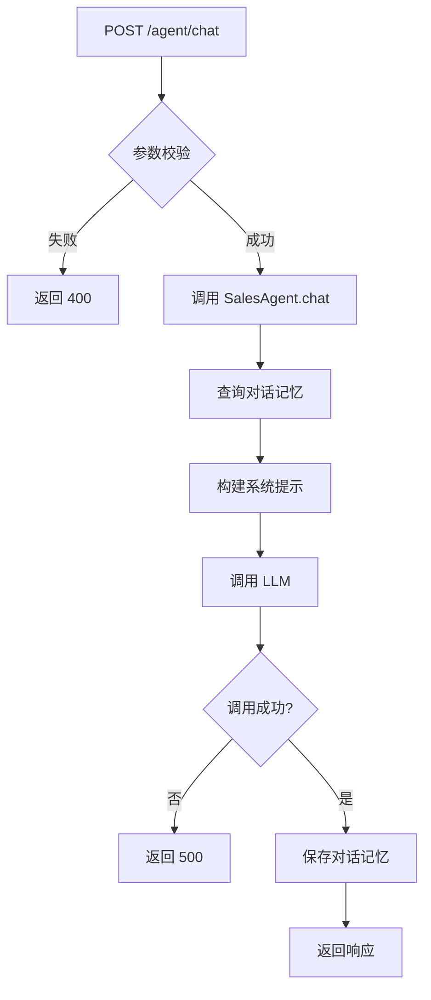
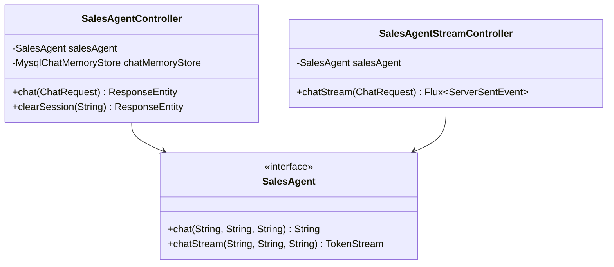

# 销售聊天模块 - 技术实施方案

## 1. 方案概述

**功能编号**：SPEC-002  
**功能名称**：销售聊天  
**所属模块**：agent  
**版本**：1.0  
**创建日期**：2024-01-15  
**状态**：已通过  

---

## 2. 需求分析

### 2.1 功能需求回顾

实现同步和流式聊天接口，基于 LangChain4j 框架调用通义千问大模型。

### 2.2 技术挑战

| 挑战 | 描述 | 风险等级 |
|------|------|----------|
| 流式响应 | 需要处理 SSE 实时推送 | 高 |
| 对话记忆 | 需要持久化和管理历史对话 | 中 |
| API 调用 | 需要处理 LLM 服务的超时和错误 | 高 |

---

## 3. 技术方案

### 3.1 架构设计

#### 3.1.1 模块划分

| 模块 | 职责 | 状态 |
|------|------|------|
| SalesAgentController | 同步聊天入口 | 新增 |
| SalesAgentStreamController | 流式聊天入口 | 新增 |
| SalesAgent | AI Agent 接口 | 新增 |
| SalesAgentConfig | Agent 配置 | 新增 |
| MysqlChatMemoryStore | 对话记忆存储 | 新增 |

#### 3.1.2 核心流程图



#### 3.1.3 类图



### 3.2 目录结构

```
src/main/java/com/mk/salesAgent/
├── controller/
│   ├── SalesAgentController.java      # 同步聊天控制器
│   └── SalesAgentStreamController.java # 流式聊天控制器
├── agent/
│   ├── SalesAgent.java                # Agent 接口
│   └── SalesAgentConfig.java          # Agent 配置类
├── memory/
│   └── MysqlChatMemoryStore.java      # 对话记忆存储
└── dto/
    ├── ChatRequest.java               # 聊天请求
    └── ChatResponse.java              # 聊天响应
```

### 3.3 关键类设计

#### 3.3.1 SalesAgent 接口

| 类名 | 文件路径 | 职责 |
|------|----------|------|
| SalesAgent | agent/SalesAgent.java | 定义 AI 聊天接口 |

**方法设计**：

| 方法名 | 功能说明 | 参数 | 返回值 |
|--------|----------|------|--------|
| chat | 同步聊天 | sessionId, message, today | String |
| chatStream | 流式聊天 | sessionId, message, today | TokenStream |

#### 3.3.2 SalesAgentController

| 类名 | 文件路径 | 职责 |
|------|----------|------|
| SalesAgentController | controller/SalesAgentController.java | 处理同步聊天请求 |

**方法设计**：

| 方法名 | 功能说明 | 参数 | 返回值 |
|--------|----------|------|--------|
| chat | 同步聊天 | ChatRequest | ResponseEntity\<ChatResponse\> |
| clearSession | 清除会话 | sessionId | ResponseEntity |

#### 3.3.3 SalesAgentStreamController

| 类名 | 文件路径 | 职责 |
|------|----------|------|
| SalesAgentStreamController | controller/SalesAgentStreamController.java | 处理流式聊天请求 |

**方法设计**：

| 方法名 | 功能说明 | 参数 | 返回值 |
|--------|----------|------|--------|
| chatStream | 流式聊天 | ChatRequest | Flux\<ServerSentEvent\<String\>\> |

### 3.4 数据库设计

#### 3.4.1 表结构

**表名**：sa_chat_memory

| 字段名 | 类型 | 约束 | 说明 |
|--------|------|------|------|
| id | BIGINT | PRIMARY KEY, AUTO_INCREMENT | 主键 |
| session_id | VARCHAR(100) | NOT NULL, UNIQUE | 会话ID |
| messages | LONGTEXT | NOT NULL | 消息列表(JSON) |
| updated_at | DATETIME | NOT NULL | 更新时间 |

#### 3.4.2 索引设计

| 索引名 | 字段 | 类型 | 说明 |
|--------|------|------|------|
| PRIMARY | id | PRIMARY KEY | 主键索引 |
| uk_session | session_id | UNIQUE | 会话ID唯一索引 |

### 3.5 API 接口设计

#### 3.5.1 接口列表

| API 路径 | HTTP 方法 | 所属文件 |
|----------|-----------|----------|
| /agent/chat | POST | SalesAgentController.java |
| /agent/chat/stream | POST | SalesAgentStreamController.java |
| /agent/session/{sessionId} | DELETE | SalesAgentController.java |

#### 3.5.2 请求结构

| 字段 | 类型 | 必填 | 说明 |
|------|------|------|------|
| sessionId | String | 是 | 会话ID |
| message | String | 是 | 用户消息 |

#### 3.5.3 响应结构

**同步响应**：

| 字段 | 类型 | 说明 |
|------|------|------|
| sessionId | String | 会话ID |
| reply | String | AI回复 |
| durationMs | Long | 耗时(毫秒) |

**流式响应**：

| 字段 | 类型 | 说明 |
|------|------|------|
| event | String | 事件类型(token/done/error) |
| data | String | 数据内容 |

---

## 4. 部署与集成

### 4.1 依赖说明

| 依赖 | GroupId | ArtifactId | 版本 |
|------|---------|------------|------|
| LangChain4j | dev.langchain4j | langchain4j-spring-boot-starter | 1.12.1 |
| LangChain4j OpenAI | dev.langchain4j | langchain4j-open-ai-spring-boot-starter | 1.12.1 |

### 4.2 配置说明

```yaml
langchain4j:
  open-ai:
    chat-model:
      base-url: https://dashscope.aliyuncs.com/compatible-mode/v1
      api-key: ${DASH_SCOPE_API_KEY}
      model-name: qwen-max
      temperature: 0.1
      max-tokens: 2048
```

### 4.3 集成测试

| 测试场景 | 测试方法 | 预期结果 |
|----------|----------|----------|
| 发送消息 | 调用 POST /agent/chat | 返回 AI 回复 |
| 流式消息 | 调用 POST /agent/chat/stream | 收到 SSE 事件流 |
| 清除会话 | 调用 DELETE /agent/session/{id} | 返回成功消息 |

---

## 5. 代码安全性

### 5.1 注意事项

| 风险点 | 描述 | 关联模块 |
|--------|------|----------|
| 注入攻击 | 用户消息可能包含恶意内容 | SalesAgent |
| API Key 泄露 | 配置文件中的密钥 | application.yml |
| 会话劫持 | sessionId 被劫持 | SalesAgentController |

### 5.2 解决方案

| 风险点 | 解决方案 |
|--------|----------|
| 注入攻击 | 使用 LangChain4j 工具调用安全机制 |
| API Key 泄露 | 使用环境变量注入 |
| 会话劫持 | sessionId 使用 UUID，设置合理过期时间 |

---

## 6. 评审记录

| 日期 | 评审人 | 意见 | 状态 |
|------|--------|------|------|
| 2024-01-15 | 架构师 | 无意见 | 通过 |
