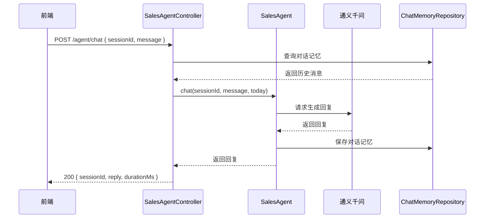
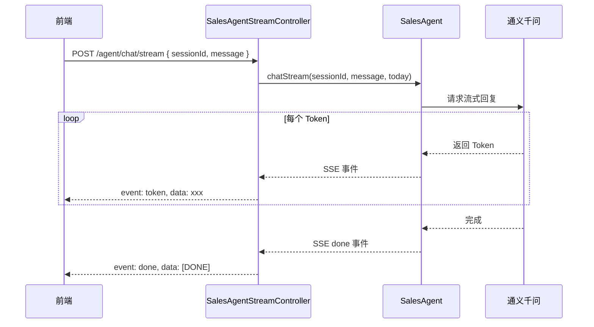
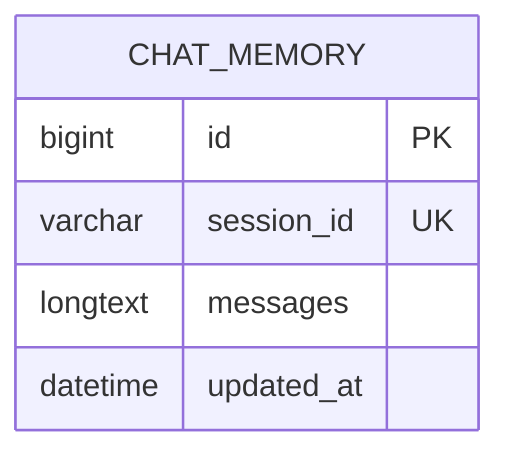

# 销售聊天模块 - 功能规格说明书

## 1. 功能概述

**功能编号**：SPEC-002  
**功能名称**：销售聊天  
**所属模块**：agent  
**版本**：1.0  
**创建日期**：2024-01-15  
**状态**：已通过  

---

## 2. 业务背景

用户通过自然语言与 AI Agent 进行对话，查询销售数据。系统需要支持同步和流式两种响应方式，同时维护对话记忆以支持多轮对话。

---

## 3. 功能需求

### 3.1 功能描述

- 同步聊天：用户发送消息，AI 生成完整回复后返回
- 流式聊天：用户发送消息，AI 逐词返回回复（SSE）
- 会话管理：清除指定会话的对话记忆

### 3.2 需求来源

| 来源类型 | 编号 | 描述 |
|----------|------|------|
| 产品需求 | PRD-002 | 支持自然语言查询销售数据 |

### 3.3 功能边界

- 包含：同步聊天、流式聊天、清除会话记忆
- 不包含：修改数据、发送邮件、外部通知

---

## 4. 业务流程

### 4.1 同步聊天流程图



### 4.2 流式聊天流程图



---

## 5. 接口设计

### 5.1 接口清单

| API 路径 | HTTP 方法 | 所属文件 | 功能描述 |
|----------|-----------|----------|----------|
| /agent/chat | POST | SalesAgentController.java | 同步聊天 |
| /agent/chat/stream | POST | SalesAgentStreamController.java | 流式聊天 |
| /agent/session/{sessionId} | DELETE | SalesAgentController.java | 清除会话 |

### 5.2 同步聊天接口

**请求结构**：

```json
{
  "sessionId": "string (必填，会话ID，最大100字符)",
  "message": "string (必填，用户消息，最大2000字符)"
}
```

**成功响应**：

```json
{
  "sessionId": "string (会话ID)",
  "reply": "string (AI回复内容)",
  "durationMs": "number (请求耗时，毫秒)"
}
```

### 5.3 流式聊天接口

**请求结构**：同同步聊天

**成功响应**（SSE）：

```
event: token
data: 已

event: token
data: 为您生成近6个月销售趋势

event: done
data: [DONE]
```

### 5.4 清除会话接口

**路径参数**：

| 参数 | 类型 | 说明 |
|------|------|------|
| sessionId | String | 会话ID |

**成功响应**：

```json
{
  "message": "会话记忆已清除",
  "sessionId": "string (被清除的会话ID)"
}
```

### 5.5 错误响应

| 错误码 | 错误信息 | 触发条件 |
|--------|----------|----------|
| 400 | sessionId 不能为空 | 缺少 sessionId |
| 400 | message 不能为空 | 缺少 message |
| 500 | 服务暂时不可用 | LLM 服务异常 |

---

## 6. 数据模型

### 6.1 实体关系



### 6.2 字段定义

| 字段名 | 类型 | 约束 | 说明 |
|--------|------|------|------|
| id | BIGINT | PRIMARY KEY, AUTO_INCREMENT | 主键 |
| session_id | VARCHAR(100) | NOT NULL, UNIQUE | 会话ID |
| messages | LONGTEXT | NOT NULL | 序列化的消息列表(JSON) |
| updated_at | DATETIME | NOT NULL, ON UPDATE CURRENT_TIMESTAMP | 更新时间 |

---

## 7. 业务规则

| 规则编号 | 规则描述 | 优先级 |
|----------|----------|--------|
| RULE-CHAT-001 | 消息长度限制为 2000 字符 | 高 |
| RULE-CHAT-002 | 只允许查询数据，不允许修改 | 高 |
| RULE-CHAT-003 | 对话记忆保留 7 天 | 中 |

---

## 8. 非功能需求

### 8.1 性能要求

| 指标 | 要求 |
|------|------|
| 同步响应时间 | < 5000ms |
| 流式响应延迟 | < 100ms/Token |

### 8.2 安全要求

- 会话ID 使用 UUID 格式
- 对话内容存储时进行脱敏处理

---

## 9. 验收标准

### 9.1 功能验收

| 测试用例 | 预期结果 |
|----------|----------|
| 发送有效消息 | 返回 AI 回复 |
| 空 sessionId | 返回 400 错误 |
| 空 message | 返回 400 错误 |
| 清除会话 | 成功清除记忆 |
| 流式响应 | 逐词返回回复 |

---

## 10. 依赖关系

### 10.1 上游依赖

| 模块 | 说明 |
|------|------|
| SalesAgent | AI Agent 接口 |
| MysqlChatMemoryStore | 对话记忆存储 |

### 10.2 下游依赖

| 模块 | 说明 |
|------|------|
| LangChain4j | AI 框架 |
| DashScope | LLM 服务 |

---

## 11. 评审记录

| 日期 | 评审人 | 意见 | 状态 |
|------|--------|------|------|
| 2024-01-15 | 架构师 | 无意见 | 通过 |
