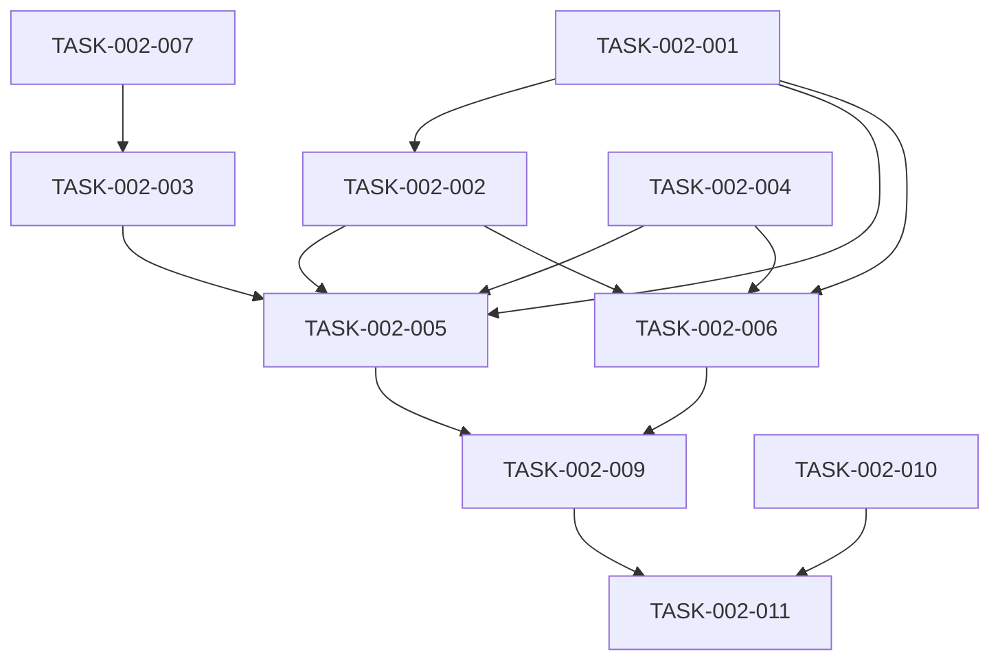

# 销售聊天模块 - 任务拆解清单

## 1. 任务概览

| 任务编号 | 任务名称 | 负责人 | 预估工时 | 状态 |
|----------|----------|--------|----------|------|
| TASK-002-001 | 创建 SalesAgent 接口 | 后端开发 | 1h | 待开始 |
| TASK-002-002 | 创建 SalesAgentConfig 配置类 | 后端开发 | 2h | 待开始 |
| TASK-002-003 | 创建 MysqlChatMemoryStore | 后端开发 | 2h | 待开始 |
| TASK-002-004 | 创建 ChatRequest/ChatResponse DTO | 后端开发 | 0.5h | 待开始 |
| TASK-002-005 | 创建 SalesAgentController | 后端开发 | 2h | 待开始 |
| TASK-002-006 | 创建 SalesAgentStreamController | 后端开发 | 2h | 待开始 |
| TASK-002-007 | 创建 ChatMemoryRepository | 后端开发 | 1h | 待开始 |
| TASK-002-008 | 编写数据库脚本 | 后端开发 | 1h | 待开始 |
| TASK-002-009 | 编写单元测试 | 后端开发 | 2h | 待开始 |
| TASK-002-010 | 前端聊天页面 | 前端开发 | 4h | 待开始 |
| TASK-002-011 | 联调测试 | 前后端开发 | 2h | 待开始 |

---

## 2. 任务详情

### TASK-002-001：创建 SalesAgent 接口

**描述**：定义 AI Agent 聊天接口，包含同步和流式方法

**输入**：无

**输出**：SalesAgent.java

**依赖任务**：无

**验收标准**：接口定义完整，包含 @SystemMessage 和 @UserMessage 注解

---

### TASK-002-002：创建 SalesAgentConfig 配置类

**描述**：配置 LangChain4j AI Service，注册工具和记忆存储

**输入**：无

**输出**：SalesAgentConfig.java

**依赖任务**：TASK-002-001

**验收标准**：正确配置工具列表、记忆存储和模型参数

---

### TASK-002-003：创建 MysqlChatMemoryStore

**描述**：实现基于 MySQL 的对话记忆存储

**输入**：无

**输出**：MysqlChatMemoryStore.java

**依赖任务**：TASK-002-007

**验收标准**：实现 getAllMessages、updateMessages、deleteMessages 方法

---

### TASK-002-004：创建 ChatRequest/ChatResponse DTO

**描述**：创建聊天请求和响应的数据传输对象

**输入**：无

**输出**：ChatRequest.java, ChatResponse.java

**依赖任务**：无

**验收标准**：包含必要字段和校验注解

---

### TASK-002-005：创建 SalesAgentController

**描述**：实现同步聊天接口和清除会话接口

**输入**：SalesAgent.java, ChatRequest.java, ChatResponse.java

**输出**：SalesAgentController.java

**依赖任务**：TASK-002-001, TASK-002-004

**验收标准**：正确处理请求，返回正确响应格式

---

### TASK-002-006：创建 SalesAgentStreamController

**描述**：实现流式聊天接口（SSE）

**输入**：SalesAgent.java, ChatRequest.java

**输出**：SalesAgentStreamController.java

**依赖任务**：TASK-002-001, TASK-002-004

**验收标准**：正确推送 SSE 事件，支持 token/done/error 事件类型

---

### TASK-002-007：创建 ChatMemoryRepository

**描述**：创建对话记忆数据访问层

**输入**：ChatMemoryEntity.java

**输出**：ChatMemoryRepository.java

**依赖任务**：无

**验收标准**：继承 JpaRepository，包含必要的查询方法

---

### TASK-002-008：编写数据库脚本

**描述**：创建 sa_chat_memory 表的 DDL

**输入**：无

**输出**：schema.sql（新增表定义）

**依赖任务**：无

**验收标准**：表结构正确，包含必要索引

---

### TASK-002-009：编写单元测试

**描述**：编写聊天接口的单元测试用例

**输入**：SalesAgentController.java

**输出**：SalesAgentControllerTest.java

**依赖任务**：TASK-002-005, TASK-002-006

**验收标准**：测试覆盖率 >= 80%，所有测试通过

---

### TASK-002-010：前端聊天页面

**描述**：创建聊天页面，支持同步和流式消息显示

**输入**：无

**输出**：ChatView.vue

**依赖任务**：TASK-002-005, TASK-002-006

**验收标准**：消息气泡显示正确，流式消息逐字显示

---

### TASK-002-011：联调测试

**描述**：前后端联调，验证聊天功能

**输入**：完整的前后端代码

**输出**：联调测试报告

**依赖任务**：TASK-002-009, TASK-002-010

**验收标准**：聊天流程完整，消息正确显示

---

## 3. 依赖关系图

---

## 4. 备注

- TASK-002-007 和 TASK-002-008 可并行执行
- TASK-002-010 需等待 TASK-002-005 和 TASK-002-006 完成
- 联调测试需等待所有后端和前端任务完成
