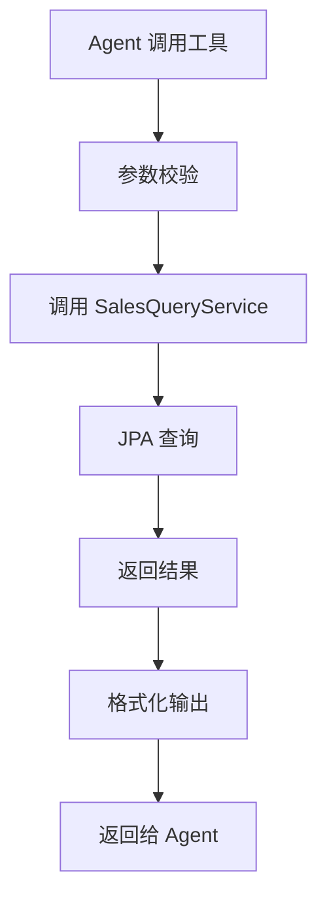
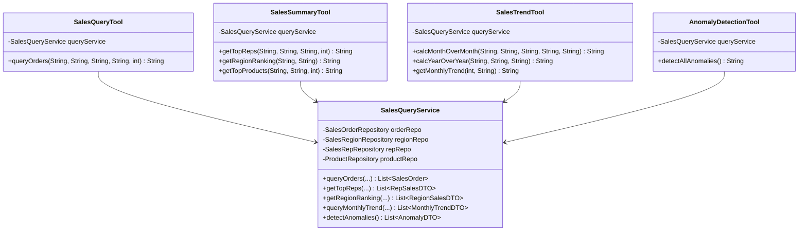

# 销售分析模块 - 技术实施方案

## 1. 方案概述

**功能编号**：SPEC-003  
**功能名称**：销售分析  
**所属模块**：tool  
**版本**：1.0  
**创建日期**：2024-01-15  
**状态**：已通过  

---

## 2. 需求分析

### 2.1 功能需求回顾

实现四个分析工具：SalesQueryTool、SalesSummaryTool、SalesTrendTool、AnomalyDetectionTool。

### 2.2 技术挑战

| 挑战 | 描述 | 风险等级 |
|------|------|----------|
| 复杂查询 | 需要处理多维度聚合查询 | 高 |
| 性能优化 | 大数据量查询需要优化 | 中 |
| 异常检测 | 需要定义合理的异常规则 | 中 |

---

## 3. 技术方案

### 3.1 架构设计

#### 3.1.1 模块划分

| 模块 | 职责 | 状态 |
|------|------|------|
| SalesQueryTool | 订单查询工具 | 新增 |
| SalesSummaryTool | 销售汇总工具 | 新增 |
| SalesTrendTool | 趋势分析工具 | 新增 |
| AnomalyDetectionTool | 异常检测工具 | 新增 |
| SalesQueryService | 数据查询服务 | 新增 |

#### 3.1.2 核心流程图



#### 3.1.3 类图



### 3.2 目录结构

```
src/main/java/com/mk/salesAgent/
├── tool/
│   ├── SalesQueryTool.java        # 订单查询工具
│   ├── SalesSummaryTool.java      # 销售汇总工具
│   ├── SalesTrendTool.java        # 趋势分析工具
│   └── AnomalyDetectionTool.java  # 异常检测工具
├── service/
│   └── SalesQueryService.java     # 数据查询服务
└── dto/
    ├── MonthlyTrendDTO.java       # 月度趋势DTO
    ├── RegionSalesDTO.java        # 大区销售DTO
    ├── ProductSalesDTO.java       # 产品销售DTO
    ├── RepSalesDTO.java           # 销售员销售DTO
    └── AnomalyDTO.java            # 异常DTO
```

### 3.3 关键类设计

#### 3.3.1 SalesQueryService

| 类名 | 文件路径 | 职责 |
|------|----------|------|
| SalesQueryService | service/SalesQueryService.java | 封装所有销售数据查询逻辑 |

**方法设计**：

| 方法名 | 功能说明 | 参数 | 返回值 |
|--------|----------|------|--------|
| queryOrders | 查询订单列表 | startDate, endDate, regionId, repId, limit | List\<SalesOrder\> |
| getTopReps | 销售员排名 | startDate, endDate, regionId, topN | List\<RepSalesDTO\> |
| getRegionRanking | 大区排名 | startDate, endDate | List\<RegionSalesDTO\> |
| getTopProducts | 产品排名 | startDate, endDate, topN | List\<ProductSalesDTO\> |
| queryMonthlyTrend | 月度趋势 | regionId, months | List\<MonthlyTrendDTO\> |
| detectAnomalies | 检测异常 | 无 | List\<AnomalyDTO\> |
| getRegionIdByName | 大区名称转ID | regionName | Long |
| getRepIdByName | 销售员名称转ID | repName | Long |

#### 3.3.2 SalesQueryTool

| 类名 | 文件路径 | 职责 |
|------|----------|------|
| SalesQueryTool | tool/SalesQueryTool.java | 订单查询工具，供 Agent 调用 |

**方法设计**：

| 方法名 | 功能说明 | 参数 | 返回值 |
|--------|----------|------|--------|
| queryOrders | 查询订单 | startDate, endDate, regionName, repName, limit | String |

#### 3.3.3 SalesSummaryTool

| 类名 | 文件路径 | 职责 |
|------|----------|------|
| SalesSummaryTool | tool/SalesSummaryTool.java | 销售汇总工具 |

**方法设计**：

| 方法名 | 功能说明 | 参数 | 返回值 |
|--------|----------|------|--------|
| getTopReps | 销售员排名 | startDate, endDate, regionName, topN | String |
| getRegionRanking | 大区排名 | startDate, endDate | String |
| getTopProducts | 产品排名 | startDate, endDate, topN | String |

#### 3.3.4 SalesTrendTool

| 类名 | 文件路径 | 职责 |
|------|----------|------|
| SalesTrendTool | tool/SalesTrendTool.java | 趋势分析工具 |

**方法设计**：

| 方法名 | 功能说明 | 参数 | 返回值 |
|--------|----------|------|--------|
| calcMonthOverMonth | 环比分析 | currentStart, currentEnd, prevStart, prevEnd, regionName | String |
| calcYearOverYear | 同比分析 | startDate, endDate, regionName | String |
| getMonthlyTrend | 月度趋势 | months, regionName | String |

#### 3.3.5 AnomalyDetectionTool

| 类名 | 文件路径 | 职责 |
|------|----------|------|
| AnomalyDetectionTool | tool/AnomalyDetectionTool.java | 异常检测工具 |

**方法设计**：

| 方法名 | 功能说明 | 参数 | 返回值 |
|--------|----------|------|--------|
| detectAllAnomalies | 检测所有异常 | 无 | String |

### 3.4 DTO 设计

**MonthlyTrendDTO**：

| 字段名 | 类型 | 说明 |
|--------|------|------|
| month | String | 月份 |
| totalAmount | BigDecimal | 销售总额 |
| orderCount | Integer | 订单数量 |

**RegionSalesDTO**：

| 字段名 | 类型 | 说明 |
|--------|------|------|
| regionId | Long | 大区ID |
| regionName | String | 大区名称 |
| totalAmount | BigDecimal | 销售总额 |

**ProductSalesDTO**：

| 字段名 | 类型 | 说明 |
|--------|------|------|
| productId | Long | 产品ID |
| productName | String | 产品名称 |
| skuCode | String | SKU编码 |
| totalAmount | BigDecimal | 销售总额 |

**RepSalesDTO**：

| 字段名 | 类型 | 说明 |
|--------|------|------|
| repId | Long | 销售员ID |
| repName | String | 销售员姓名 |
| totalAmount | BigDecimal | 销售总额 |

**AnomalyDTO**：

| 字段名 | 类型 | 说明 |
|--------|------|------|
| type | String | 异常类型 |
| message | String | 异常描述 |
| severity | String | 严重程度 |

---

## 4. 部署与集成

### 4.1 依赖说明

| 依赖 | GroupId | ArtifactId | 版本 |
|------|---------|------------|------|
| LangChain4j | dev.langchain4j | langchain4j-spring-boot-starter | 1.12.1 |

### 4.2 配置说明

```yaml
sales-agent:
  tool:
    anomaly-threshold-days: 5
    trend-drop-threshold: 0.3
```

### 4.3 集成测试

| 测试场景 | 测试方法 | 预期结果 |
|----------|----------|----------|
| 查询订单 | 调用工具方法 | 返回订单列表 |
| 销售员排名 | 调用工具方法 | 返回排名结果 |
| 趋势分析 | 调用工具方法 | 返回趋势数据 |
| 异常检测 | 调用工具方法 | 返回异常列表 |

---

## 5. 代码安全性

### 5.1 注意事项

| 风险点 | 描述 | 关联模块 |
|--------|------|----------|
| SQL 注入 | 用户输入可能包含恶意 SQL | SalesQueryService |
| 参数校验 | 未校验的输入可能导致错误 | 所有工具 |

### 5.2 解决方案

| 风险点 | 解决方案 |
|--------|----------|
| SQL 注入 | 使用 JPA 参数化查询 |
| 参数校验 | 使用 @P 注解和自定义校验 |

---

## 6. 评审记录

| 日期 | 评审人 | 意见 | 状态 |
|------|--------|------|------|
| 2024-01-15 | 架构师 | 无意见 | 通过 |
