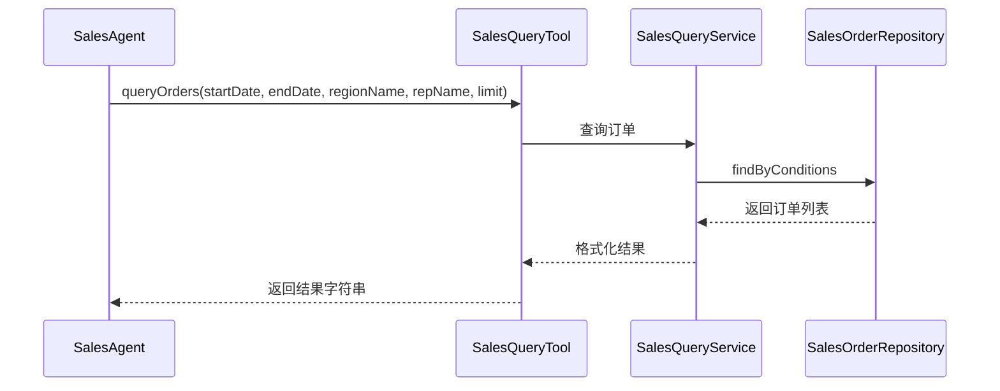
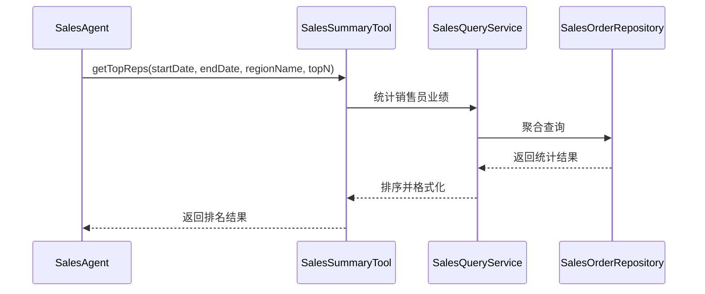
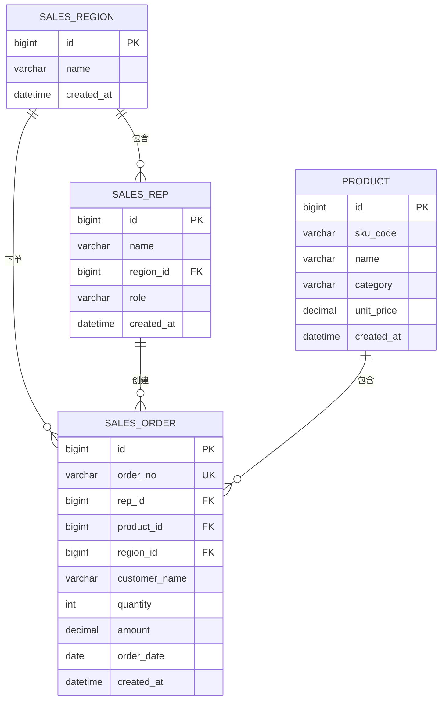

# 销售分析模块 - 功能规格说明书

## 1. 功能概述

**功能编号**：SPEC-003  
**功能名称**：销售分析  
**所属模块**：tool  
**版本**：1.0  
**创建日期**：2024-01-15  
**状态**：已通过  

---

## 2. 业务背景

用户需要通过自然语言查询销售数据，系统需要提供多种数据分析能力，包括订单查询、销售汇总、趋势分析和异常检测。

---

## 3. 功能需求

### 3.1 功能描述

- **订单查询**：按时间范围、大区、销售员筛选订单
- **销售汇总**：统计总额、排名、Top N 销售员/产品
- **趋势分析**：同比/环比分析、月度趋势
- **异常检测**：识别销售数据异常（订单暴跌、断货预警等）

### 3.2 需求来源

| 来源类型 | 编号 | 描述 |
|----------|------|------|
| 产品需求 | PRD-003 | 提供销售数据分析能力 |

### 3.3 功能边界

- 包含：查询、统计、分析、检测
- 不包含：修改数据、发送通知

---

## 4. 业务流程

### 4.1 订单查询流程



### 4.2 销售汇总流程



---

## 5. 工具接口设计

### 5.1 工具清单

| 工具名称 | 方法名 | 功能描述 |
|----------|--------|----------|
| SalesQueryTool | queryOrders | 查询订单列表 |
| SalesSummaryTool | getTopReps | 销售员排名 |
| SalesSummaryTool | getRegionRanking | 大区排名 |
| SalesSummaryTool | getTopProducts | 产品排名 |
| SalesTrendTool | calcMonthOverMonth | 环比分析 |
| SalesTrendTool | calcYearOverYear | 同比分析 |
| SalesTrendTool | getMonthlyTrend | 月度趋势 |
| AnomalyDetectionTool | detectAllAnomalies | 异常检测 |

### 5.2 SalesQueryTool

**方法**：queryOrders

**参数**：

| 参数 | 类型 | 必填 | 说明 |
|------|------|------|------|
| startDate | String | 是 | 开始日期(yyyy-MM-dd) |
| endDate | String | 是 | 结束日期(yyyy-MM-dd) |
| regionName | String | 否 | 大区名称 |
| repName | String | 否 | 销售员姓名 |
| limit | int | 否 | 最大返回条数(默认20,最大50) |

**返回格式**：

```
查询结果（共 N 条）：
1. 订单号: xxx, 客户: xxx, 金额: ¥xxx, 日期: yyyy-MM-dd
2. ...
```

### 5.3 SalesSummaryTool

**方法**：getTopReps

**参数**：

| 参数 | 类型 | 必填 | 说明 |
|------|------|------|------|
| startDate | String | 是 | 开始日期 |
| endDate | String | 是 | 结束日期 |
| regionName | String | 否 | 大区名称 |
| topN | int | 否 | 返回前N名(默认5) |

**返回格式**：

```
2024年1月销售员业绩排名（TOP 5）：
1. 李明 - ¥285,000（华东区）
2. ...
```

**方法**：getRegionRanking

**参数**：

| 参数 | 类型 | 必填 | 说明 |
|------|------|------|------|
| startDate | String | 是 | 开始日期 |
| endDate | String | 是 | 结束日期 |

**返回格式**：

```
2024年1月各大区销售排名：
1. 华东区 - ¥890,500（占比 35.2%）
2. ...
```

**方法**：getTopProducts

**参数**：

| 参数 | 类型 | 必填 | 说明 |
|------|------|------|------|
| startDate | String | 是 | 开始日期 |
| endDate | String | 是 | 结束日期 |
| topN | int | 否 | 返回前N名(默认5) |

**返回格式**：

```
2024年1月产品销量排名（TOP 5）：
1. SKU-1001 笔记本电脑 - ¥320,000（32台）
2. ...
```

### 5.4 SalesTrendTool

**方法**：calcMonthOverMonth

**参数**：

| 参数 | 类型 | 必填 | 说明 |
|------|------|------|------|
| currentStart | String | 是 | 当前周期开始 |
| currentEnd | String | 是 | 当前周期结束 |
| prevStart | String | 是 | 对比周期开始 |
| prevEnd | String | 是 | 对比周期结束 |
| regionName | String | 否 | 大区名称 |

**返回格式**：

```
华东区 2024年2月 vs 1月 环比分析：
- 销售额：¥987,500 vs ¥890,500
- 环比增长：+10.9%
- 订单数量：156 vs 142（+9.9%）
```

**方法**：calcYearOverYear

**参数**：

| 参数 | 类型 | 必填 | 说明 |
|------|------|------|------|
| startDate | String | 是 | 开始日期 |
| endDate | String | 是 | 结束日期 |
| regionName | String | 否 | 大区名称 |

**返回格式**：

```
全公司 2024年1月 vs 2023年1月 同比分析：
- 销售额：¥2,527,800 vs ¥2,156,300
- 同比增长：+17.2%
```

**方法**：getMonthlyTrend

**参数**：

| 参数 | 类型 | 必填 | 说明 |
|------|------|------|------|
| months | int | 是 | 近N个月(最大24) |
| regionName | String | 否 | 大区名称 |

**返回格式**：

```
全公司近6个月销售趋势：
2024-08: ¥2,156,000
2024-09: ¥2,345,000（+8.8%）
...
```

### 5.5 AnomalyDetectionTool

**方法**：detectAllAnomalies

**参数**：无

**返回格式**：

```
检测到以下异常：
【订单暴跌预警】华北区近14天无订单
【断货预警】产品 SKU-8821 近30天零销售
【业绩断崖预警】销售员 张磊 近60天仅1单
```

---

## 6. 数据模型

### 6.1 实体关系



---

## 7. 业务规则

| 规则编号 | 规则描述 | 优先级 |
|----------|----------|--------|
| RULE-ANALYSIS-001 | 日期格式必须为 yyyy-MM-dd | 高 |
| RULE-ANALYSIS-002 | startDate 必须小于等于 endDate | 高 |
| RULE-ANALYSIS-003 | limit 参数最大为 50 | 高 |
| RULE-ANALYSIS-004 | months 参数最大为 24 | 高 |
| RULE-ANALYSIS-005 | 只统计状态为 COMPLETED 的订单 | 高 |

---

## 8. 非功能需求

### 8.1 性能要求

| 指标 | 要求 |
|------|------|
| 查询响应时间 | < 1000ms |
| 支持最大查询范围 | 1年 |

---

## 9. 验收标准

### 9.1 功能验收

| 测试用例 | 预期结果 |
|----------|----------|
| 查询指定日期范围订单 | 返回正确数量的订单 |
| 查询不存在的大区 | 返回错误提示 |
| 销售员排名 | 返回正确的排名顺序 |
| 同比分析 | 正确计算增长率 |
| 异常检测 | 检测到预设的异常数据 |

---

## 10. 依赖关系

### 10.1 上游依赖

| 模块 | 说明 |
|------|------|
| SalesQueryService | 数据查询服务 |
| SalesOrderRepository | 订单数据访问 |

---

## 11. 评审记录

| 日期 | 评审人 | 意见 | 状态 |
|------|--------|------|------|
| 2024-01-15 | 架构师 | 无意见 | 通过 |
