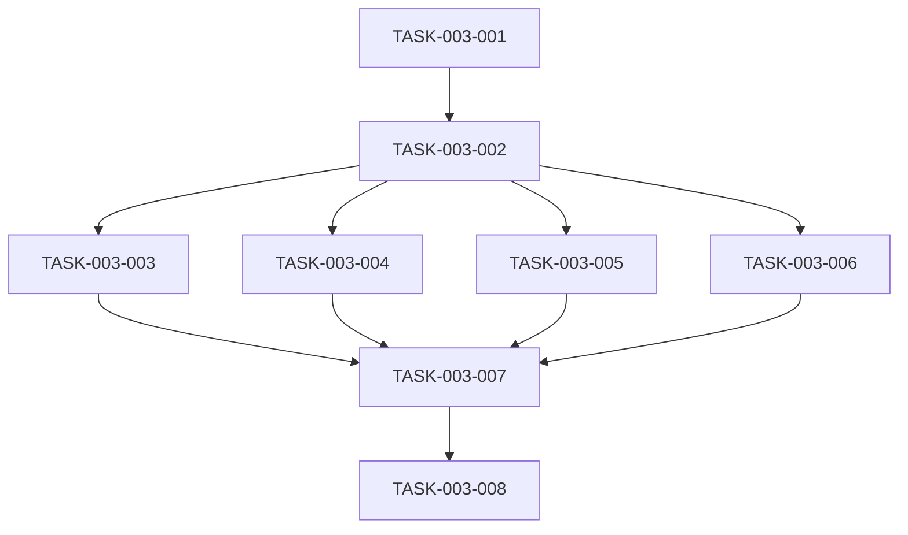

# 销售分析模块 - 任务拆解清单

## 1. 任务概览

| 任务编号 | 任务名称 | 负责人 | 预估工时 | 状态 |
|----------|----------|--------|----------|------|
| TASK-003-001 | 创建 DTO 类 | 后端开发 | 1h | 待开始 |
| TASK-003-002 | 创建 SalesQueryService | 后端开发 | 4h | 待开始 |
| TASK-003-003 | 创建 SalesQueryTool | 后端开发 | 2h | 待开始 |
| TASK-003-004 | 创建 SalesSummaryTool | 后端开发 | 2h | 待开始 |
| TASK-003-005 | 创建 SalesTrendTool | 后端开发 | 2h | 待开始 |
| TASK-003-006 | 创建 AnomalyDetectionTool | 后端开发 | 2h | 待开始 |
| TASK-003-007 | 编写单元测试 | 后端开发 | 3h | 待开始 |
| TASK-003-008 | 集成测试 | 后端开发 | 2h | 待开始 |

---

## 2. 任务详情

### TASK-003-001：创建 DTO 类

**描述**：创建所有分析相关的 DTO 类

**输入**：无

**输出**：MonthlyTrendDTO.java, RegionSalesDTO.java, ProductSalesDTO.java, RepSalesDTO.java, AnomalyDTO.java

**依赖任务**：无

**验收标准**：所有 DTO 包含必要字段，使用 record 类型

---

### TASK-003-002：创建 SalesQueryService

**描述**：实现数据查询服务，封装所有销售数据查询逻辑

**输入**：DTO 类

**输出**：SalesQueryService.java

**依赖任务**：TASK-003-001

**验收标准**：包含所有查询方法，使用 JPA 进行参数化查询

---

### TASK-003-003：创建 SalesQueryTool

**描述**：实现订单查询工具，供 Agent 调用

**输入**：SalesQueryService.java

**输出**：SalesQueryTool.java

**依赖任务**：TASK-003-002

**验收标准**：使用 @Tool 注解，正确格式化输出

---

### TASK-003-004：创建 SalesSummaryTool

**描述**：实现销售汇总工具

**输入**：SalesQueryService.java

**输出**：SalesSummaryTool.java

**依赖任务**：TASK-003-002

**验收标准**：包含 getTopReps、getRegionRanking、getTopProducts 方法

---

### TASK-003-005：创建 SalesTrendTool

**描述**：实现趋势分析工具

**输入**：SalesQueryService.java

**输出**：SalesTrendTool.java

**依赖任务**：TASK-003-002

**验收标准**：包含环比、同比、月度趋势方法

---

### TASK-003-006：创建 AnomalyDetectionTool

**描述**：实现异常检测工具

**输入**：SalesQueryService.java

**输出**：AnomalyDetectionTool.java

**依赖任务**：TASK-003-002

**验收标准**：检测订单暴跌、断货、业绩断崖等异常

---

### TASK-003-007：编写单元测试

**描述**：编写所有工具类的单元测试

**输入**：所有工具类

**输出**：测试类

**依赖任务**：TASK-003-003 ~ TASK-003-006

**验收标准**：测试覆盖率 >= 80%

---

### TASK-003-008：集成测试

**描述**：通过 ToolTestController 测试工具功能

**输入**：完整的工具代码

**输出**：集成测试报告

**依赖任务**：TASK-003-007

**验收标准**：所有工具方法调用成功

---

## 3. 依赖关系图

---

## 4. 备注

- TASK-003-003 到 TASK-003-006 可并行执行
- 单元测试需等待所有工具类完成
