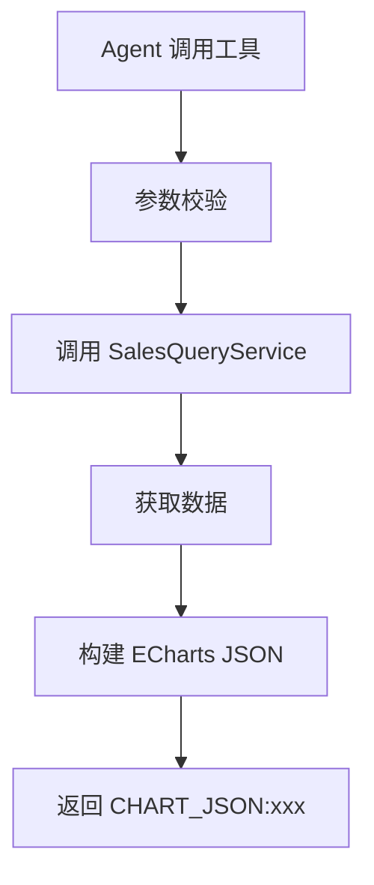
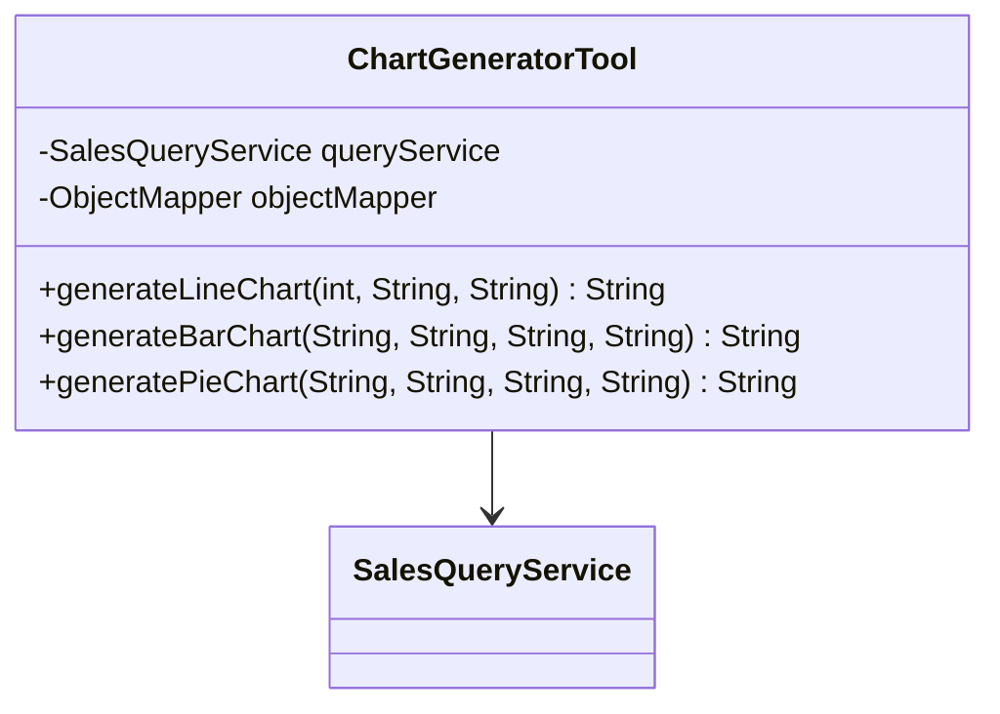

# 图表可视化模块 - 技术实施方案

## 1. 方案概述

**功能编号**：SPEC-004  
**功能名称**：图表可视化  
**所属模块**：tool  
**版本**：1.0  
**创建日期**：2024-01-15  
**状态**：已通过  

---

## 2. 需求分析

### 2.1 功能需求回顾

实现图表生成工具，支持折线图、柱状图和饼图。

### 2.2 技术挑战

| 挑战 | 描述 | 风险等级 |
|------|------|----------|
| JSON 格式 | 生成正确的 ECharts JSON 格式 | 中 |
| 数据转换 | 将查询结果转换为图表数据 | 低 |

---

## 3. 技术方案

### 3.1 架构设计

#### 3.1.1 模块划分

| 模块 | 职责 | 状态 |
|------|------|------|
| ChartGeneratorTool | 图表生成工具 | 新增 |

#### 3.1.2 核心流程图



#### 3.1.3 类图



### 3.2 目录结构

```
src/main/java/com/mk/salesAgent/
└── tool/
    └── ChartGeneratorTool.java    # 图表生成工具
```

### 3.3 关键类设计

#### 3.3.1 ChartGeneratorTool

| 类名 | 文件路径 | 职责 |
|------|----------|------|
| ChartGeneratorTool | tool/ChartGeneratorTool.java | 生成 ECharts JSON 图表数据 |

**方法设计**：

| 方法名 | 功能说明 | 参数 | 返回值 |
|--------|----------|------|--------|
| generateLineChart | 生成折线图 | months, regionName, title | String (CHART_JSON) |
| generateBarChart | 生成柱状图 | dimension, startDate, endDate, title | String (CHART_JSON) |
| generatePieChart | 生成饼图 | dimension, startDate, endDate, title | String (CHART_JSON) |

---

## 4. 部署与集成

### 4.1 依赖说明

| 依赖 | GroupId | ArtifactId | 版本 |
|------|---------|------------|------|
| Jackson | com.fasterxml.jackson.core | jackson-databind | 2.15.x |

### 4.2 集成测试

| 测试场景 | 测试方法 | 预期结果 |
|----------|----------|----------|
| 生成折线图 | 调用工具方法 | 返回 CHART_JSON 格式数据 |
| 生成柱状图 | 调用工具方法 | 返回 CHART_JSON 格式数据 |
| 生成饼图 | 调用工具方法 | 返回 CHART_JSON 格式数据 |

---

## 5. 代码安全性

### 5.1 注意事项

| 风险点 | 描述 | 关联模块 |
|--------|------|----------|
| JSON 注入 | 用户输入可能包含恶意 JSON | ChartGeneratorTool |

### 5.2 解决方案

| 风险点 | 解决方案 |
|--------|----------|
| JSON 注入 | 使用 Jackson 安全序列化 |

---

## 6. 评审记录

| 日期 | 评审人 | 意见 | 状态 |
|------|--------|------|------|
| 2024-01-15 | 架构师 | 无意见 | 通过 |
