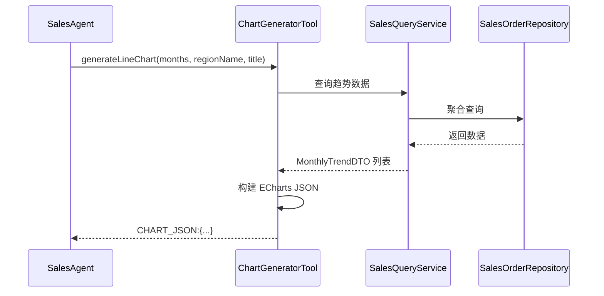

# 图表可视化模块 - 功能规格说明书

## 1. 功能概述

**功能编号**：SPEC-004  
**功能名称**：图表可视化  
**所属模块**：tool  
**版本**：1.0  
**创建日期**：2024-01-15  
**状态**：已通过  

---

## 2. 业务背景

用户需要通过图表直观展示销售数据，系统需要支持多种图表类型，包括折线图、柱状图和饼图。

---

## 3. 功能需求

### 3.1 功能描述

- **折线图**：展示销售趋势变化
- **柱状图**：对比不同维度的数据
- **饼图**：展示数据占比分布

### 3.2 需求来源

| 来源类型 | 编号 | 描述 |
|----------|------|------|
| 产品需求 | PRD-004 | 提供数据可视化能力 |

### 3.3 功能边界

- 包含：生成 ECharts JSON 格式图表数据
- 不包含：前端渲染、图表导出

---

## 4. 业务流程



---

## 5. 工具接口设计

### 5.1 工具清单

| 工具名称 | 方法名 | 功能描述 |
|----------|--------|----------|
| ChartGeneratorTool | generateLineChart | 生成折线图 |
| ChartGeneratorTool | generateBarChart | 生成柱状图 |
| ChartGeneratorTool | generatePieChart | 生成饼图 |

### 5.2 generateLineChart

**参数**：

| 参数 | 类型 | 必填 | 说明 |
|------|------|------|------|
| months | int | 是 | 近N个月(最大24) |
| regionName | String | 否 | 大区名称 |
| title | String | 否 | 图表标题 |

**返回格式**：

```
CHART_JSON:{"title":{"text":"xxx"},"xAxis":{"type":"category","data":["2024-01",...]},"yAxis":{"type":"value"},"series":[{"name":"销售额","type":"line","data":[123456,...]}]}
```

### 5.3 generateBarChart

**参数**：

| 参数 | 类型 | 必填 | 说明 |
|------|------|------|------|
| dimension | String | 是 | 维度(region/product/rep) |
| startDate | String | 是 | 开始日期(yyyy-MM-dd) |
| endDate | String | 是 | 结束日期(yyyy-MM-dd) |
| title | String | 否 | 图表标题 |

**返回格式**：

```
CHART_JSON:{"title":{"text":"xxx"},"xAxis":{"type":"category","data":["华东区",...]},"yAxis":{"type":"value"},"series":[{"name":"销售额","type":"bar","data":[123456,...]}]}
```

### 5.4 generatePieChart

**参数**：

| 参数 | 类型 | 必填 | 说明 |
|------|------|------|------|
| dimension | String | 是 | 维度(region/product/rep) |
| startDate | String | 是 | 开始日期(yyyy-MM-dd) |
| endDate | String | 是 | 结束日期(yyyy-MM-dd) |
| title | String | 否 | 图表标题 |

**返回格式**：

```
CHART_JSON:{"title":{"text":"xxx"},"series":[{"name":"销售额","type":"pie","data":[{"name":"华东区","value":123456},...]}]}
```

---

## 6. 数据模型

### 6.1 DTO 定义

**MonthlyTrendDTO**：

| 字段名 | 类型 | 说明 |
|--------|------|------|
| month | String | 月份(yyyy-MM) |
| totalAmount | BigDecimal | 销售总额 |
| orderCount | Integer | 订单数量 |

**RegionSalesDTO**：

| 字段名 | 类型 | 说明 |
|--------|------|------|
| regionId | Long | 大区ID |
| regionName | String | 大区名称 |
| totalAmount | BigDecimal | 销售总额 |

**ProductSalesDTO**：

| 字段名 | 类型 | 说明 |
|--------|------|------|
| productId | Long | 产品ID |
| productName | String | 产品名称 |
| skuCode | String | SKU编码 |
| totalAmount | BigDecimal | 销售总额 |

**RepSalesDTO**：

| 字段名 | 类型 | 说明 |
|--------|------|------|
| repId | Long | 销售员ID |
| repName | String | 销售员姓名 |
| totalAmount | BigDecimal | 销售总额 |

---

## 7. 业务规则

| 规则编号 | 规则描述 | 优先级 |
|----------|----------|--------|
| RULE-CHART-001 | 图表数据必须以 CHART_JSON: 开头 | 高 |
| RULE-CHART-002 | 生成的 JSON 必须是有效的 ECharts 配置 | 高 |
| RULE-CHART-003 | 维度参数只能是 region/product/rep | 高 |

---

## 8. 非功能需求

### 8.1 性能要求

| 指标 | 要求 |
|------|------|
| 图表生成时间 | < 500ms |

### 8.2 格式要求

- 返回的 JSON 必须符合 ECharts 配置格式
- 金额单位为分（Long 类型）

---

## 9. 验收标准

### 9.1 功能验收

| 测试用例 | 预期结果 |
|----------|----------|
| 生成折线图 | 返回有效的 ECharts 折线图 JSON |
| 生成柱状图 | 返回有效的 ECharts 柱状图 JSON |
| 生成饼图 | 返回有效的 ECharts 饼图 JSON |
| 无效维度 | 返回错误提示 |

---

## 10. 依赖关系

### 10.1 上游依赖

| 模块 | 说明 |
|------|------|
| SalesQueryService | 数据查询服务 |

---

## 11. 评审记录

| 日期 | 评审人 | 意见 | 状态 |
|------|--------|------|------|
| 2024-01-15 | 架构师 | 无意见 | 通过 |
