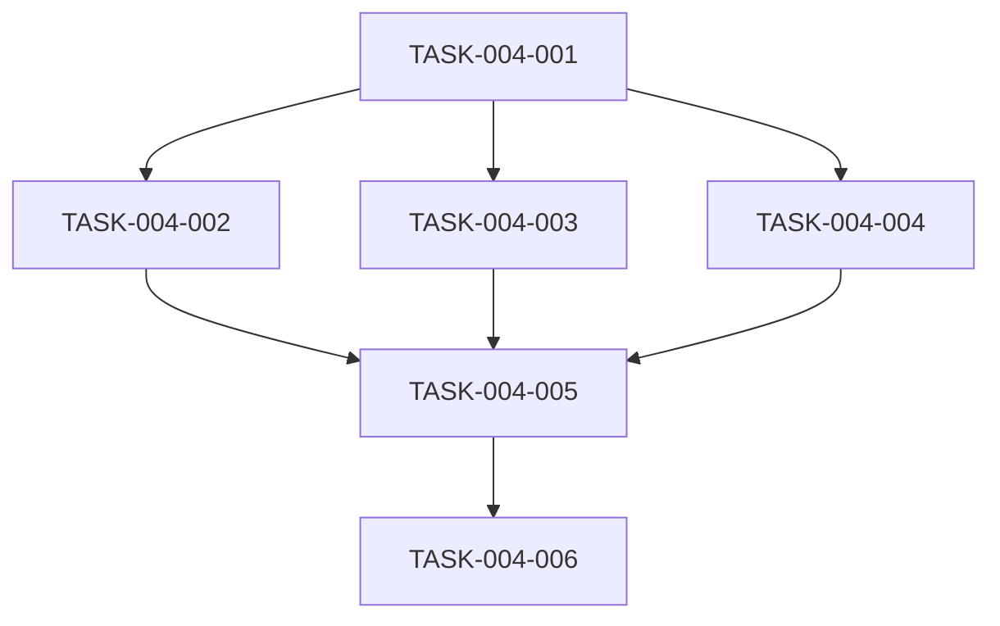

# 图表可视化模块 - 任务拆解清单

## 1. 任务概览

| 任务编号 | 任务名称 | 负责人 | 预估工时 | 状态 |
|----------|----------|--------|----------|------|
| TASK-004-001 | 创建 ChartGeneratorTool | 后端开发 | 3h | 待开始 |
| TASK-004-002 | 实现折线图生成方法 | 后端开发 | 1h | 待开始 |
| TASK-004-003 | 实现柱状图生成方法 | 后端开发 | 1h | 待开始 |
| TASK-004-004 | 实现饼图生成方法 | 后端开发 | 1h | 待开始 |
| TASK-004-005 | 编写单元测试 | 后端开发 | 2h | 待开始 |
| TASK-004-006 | 集成测试 | 后端开发 | 1h | 待开始 |

---

## 2. 任务详情

### TASK-004-001：创建 ChartGeneratorTool

**描述**：创建图表生成工具类

**输入**：无

**输出**：ChartGeneratorTool.java

**依赖任务**：SalesQueryService 已存在

**验收标准**：类结构正确，注入必要依赖

---

### TASK-004-002：实现折线图生成方法

**描述**：实现 generateLineChart 方法

**输入**：ChartGeneratorTool.java

**输出**：ChartGeneratorTool.java（已实现折线图方法）

**依赖任务**：TASK-004-001

**验收标准**：生成正确的 ECharts 折线图 JSON

---

### TASK-004-003：实现柱状图生成方法

**描述**：实现 generateBarChart 方法

**输入**：ChartGeneratorTool.java

**输出**：ChartGeneratorTool.java（已实现柱状图方法）

**依赖任务**：TASK-004-001

**验收标准**：生成正确的 ECharts 柱状图 JSON

---

### TASK-004-004：实现饼图生成方法

**描述**：实现 generatePieChart 方法

**输入**：ChartGeneratorTool.java

**输出**：ChartGeneratorTool.java（已实现饼图方法）

**依赖任务**：TASK-004-001

**验收标准**：生成正确的 ECharts 饼图 JSON

---

### TASK-004-005：编写单元测试

**描述**：编写图表生成工具的单元测试

**输入**：ChartGeneratorTool.java

**输出**：ChartGeneratorToolTest.java

**依赖任务**：TASK-004-002 ~ TASK-004-004

**验收标准**：测试覆盖率 >= 80%

---

### TASK-004-006：集成测试

**描述**：通过 ToolTestController 测试图表生成功能

**输入**：完整的工具代码

**输出**：集成测试报告

**依赖任务**：TASK-004-005

**验收标准**：所有图表生成方法调用成功

---

## 3. 依赖关系图

---

## 4. 备注

- TASK-004-002 到 TASK-004-004 可并行执行
